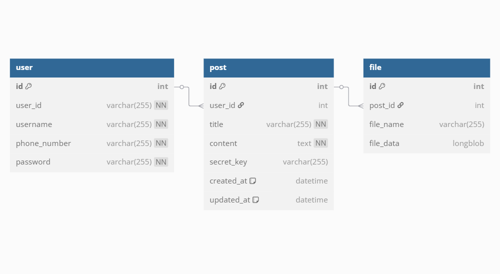

# 제목 없음

# 🗂️ 게시판 프로젝트

## 📌 프로젝트 개요

**회원 기반의 게시글 작성, 검색, 파일 첨부 기능 등을 포함한 게시판 서비스이다.**

사용자는 회원가입 및 로그인 후 게시글을 작성, 열람, 수정, 삭제할 수 있으며, 파일 첨부와 비밀글 설정도 지원한다. 세션 기반 사용자 인증을 통해 보안을 강화하였고, 업로드된 파일은 특정 게시글과 연동되어 관리된다.

## 🧪 기술 스택

  

  

## 🧩 ERD (Entity-Relationship Diagram)

게시판 서비스에서 사용된 주요 테이블 구조이다.

### 📋 테이블 목록

- `user`: 사용자 정보
- `post`: 게시글 정보
- `file`: 첨부 파일 정보

### 🔗 ERD 다이어그램

## 🛠️ 주요 기능 요약

### 🔐 사용자 기능

- 세션 기반 인증
- 회원가입 / 로그인 / 로그아웃
- 아이디 / 비밀번호 찾기

### 📝 게시판 기능

- 글 목록 조회
- 글 작성 / 수정 / 삭제
- 글 상세 보기
- 글 제목 및 내용 기반 검색
- 비밀글 설정
- 파일 첨부 기능

### 🚨 예외 처리 기능

- 커스텀 에러 페이지 제공 (400, 404, 500)

## 🔍 상세 기능

### 🔐 사용자 기능

- 회원가입
    - userid 중복 검사
    - 전화번호 유효성 검사
    - 패스워드 일치 불일치 확인
    - 패스워드 복잡도 검사(영어 대소문자, 숫자, 특수 문자 기준 4-factors)
    
    
    

- 아이디/비밀번호 찾기

- 세션이 활성화되면 사용자 맞춤 UI 위에 로그아웃 버튼 표시
    - 로그아웃 버튼 클릭 시 세션을 삭제하여 인증 상태 해제
    
    
    

- 로그인

### 📝 게시판 기능

- 전체 게시글 목록 페이지
    - 전체 게시글은 목록에서 모두 조회 가능 (제목/작성자/작성일 기준)
    - 파일 첨부된 게시글은 파일 아이콘으로 표시
    
    
    
    - 비밀글은 자물쇠 아이콘으로 표시되며, 클릭 시 비밀번호 인증 필요
        
        
        

- 게시글 내용과 제목 및 제목 + 내용 기반 검색
    
    
    

- 글 쓰기 페이지
    - 비밀글을 선택하여 비밀글 등록
    - 파일을 선택하여 업로드
    
    
    

- 게시글 상세 보기
    - 본인이 작성한 게시글에 한해서 수정 및 삭제 가능
        
        
        

- 글 수정
    - 제목과 내용엔 한해서 수정 가능
        
        
        

### 🚨 예외 처리 기능

- 주요 예외에 따른 페이지 처리

